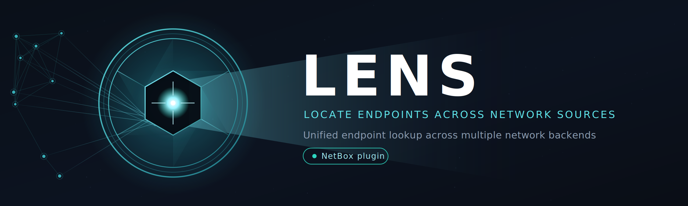
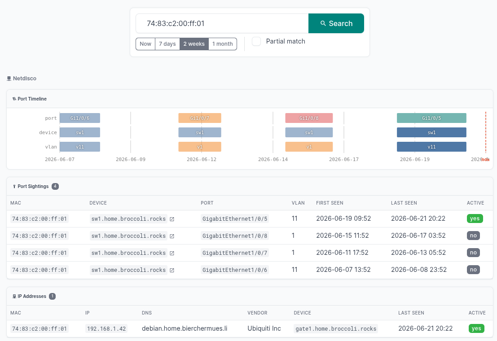

# netbox-lens

**LENS** — Locate Endpoints across Network Systems

A [NetBox](https://netbox.dev) plugin for unified endpoint lookup across multiple network data sources. Search by MAC, IP, hostname, vendor, or device name and get port sightings, IP assignments, and resolved MACs back in a single view — regardless of which backend system holds the data.



## Features

- Search by MAC, IP, hostname, vendor, or device name
- Date range filter: Now / 7 days / 2 weeks / 1 month
- Partial match mode
- Parallel queries across all configured backends
- Click-to-copy on MACs, IPs, ports, and device names
- NetBox DCIM device links inline in results (matched by name)
- **DCIM Device panel** — active MAC / port / VLAN stats on the device detail page
- **DCIM Interface panel** — live port sightings table on the interface detail page
- Backend status page with health and statistics
- Pluggable backend architecture — add new data sources by implementing a single class
- HTMX-powered inline results (no full page reload)

## Installation

```bash
pip install netbox-lens
```

Add to your NetBox `configuration.py`:

```python
PLUGINS = [
    "netbox_lens",
    # ...
]

PLUGINS_CONFIG = {
    "netbox_lens": {
        "backends": {
            "netdisco": {
                "url": "https://netdisco.example.com",
                # token via env var LENS_NETDISCO_TOKEN (recommended)
                # or inline: "token": "your-token-here"
            }
        }
    }
}
```

Set the Netdisco API token as an environment variable:

```bash
export LENS_NETDISCO_TOKEN=your-long-lived-token
```

## Backends

### Netdisco

Queries `/api/v1/search/node` for endpoint lookups and `/api/v1/object/device/{ip}/nodes` for the DCIM device/interface panels. Requires a long-lived API token (`Authorization: Bearer <token>`).

| Config key    | Default | Description                        |
|---------------|---------|------------------------------------|
| `url`         | —       | Base URL of your Netdisco instance |
| `token`       | —       | API token (prefer env var instead) |
| `verify_ssl`  | `true`  | Verify TLS certificate             |
| `timeout`     | `15`    | Request timeout in seconds         |

### Adding a backend

Implement `LensBackend` and register it:

```python
from netbox_lens.backends.base import LensBackend, SearchResult

class MyBackend(LensBackend):
    name = "mybackend"
    label = "My Backend"

    def search(self, query: str, partial: bool = False, archived: bool = False, since: str | None = None) -> SearchResult:
        result = SearchResult(backend=self.name, label=self.label, icon=self.icon)
        # ... populate result.sightings / result.ips / result.macs
        return result

    def device_nodes(self, device_ip: str) -> list:
        # optional: return list of node dicts for the DCIM device/interface panels
        # each dict: {mac, port, vlan, active, time_first, time_last}
        return []
```

Then add it to the registry in `netbox_lens/backends/__init__.py` and configure it under `PLUGINS_CONFIG["netbox_lens"]["backends"]`.

## Requirements

- NetBox 4.0+
- Python 3.12+

## License

Apache 2.0 — see [LICENSE](LICENSE).
